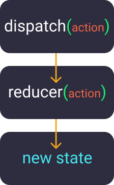

### React & ReactDOM

When writing react application we need two files:

- **React**: responsible for the creation of the React elements.
- **ReactDOM**: responsible for rendering the React elements.

### propTypes

Useful to run a _typechecking_ and to validate a component's props.

We use it on a component, assigning **special** property to an object `propTypes`:

```jsx
const MyComponent = ({ name }) => {
  return <div>Hello {name}</div>;
};

MyComponent.propTypes = {
  name: PropTypes.string,
};
```

### useEffect

Everytime we need to interact with the DOM, that interaction is a
side effect so we need to use `useEffect` for that.

And to get access to the DOM node that react creates, we need to use `useRef`
for
that.

### useRef

`useRef` gives us an object that has a property `current`, and this property
is mutable, meaning:

- if we want to make a change to something without triggering a re-render, use
  `useRef`.
- In case we want to trigger a re-render, use `useState` instead.

### useReducer

Used when state has multiple sub-values(e.g object).
Returns the current `state` and a `dispatch` function.

- The `dispatch` function will be called with an argument.
- Passes the argument to the `reducer` function as `action`.
- `reducer` returns the new state.

```javascript
const reducer = (state, action) => {
  return { ...state, action }
};
const initialState = {
  type: 'Dragon',
  age: '583',
};
const App = () => {
  const [state, dispatch] = useReducer(reducer, initialState);
  return (
    <div>
      <p onClick={() => dispatch({attack: 'fire', weakness:'hugs'})}update</p>
    </div>
  )
}
```



- single state object.
- state handling code is outside the component(independent).
